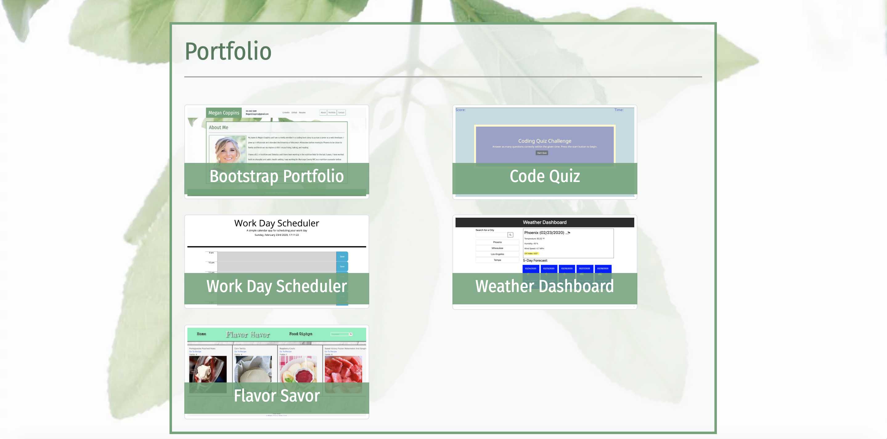
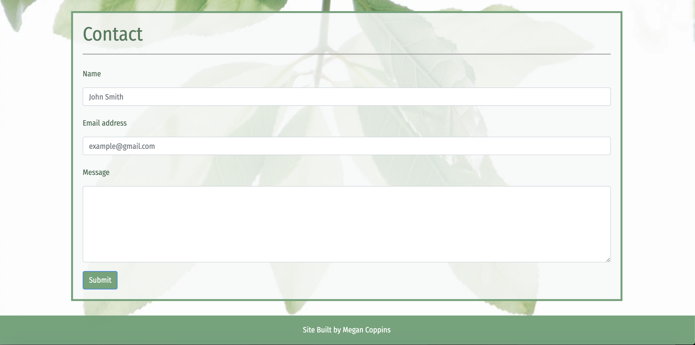

# Bootstrap-Portfolio

I built my Bootstrap Portfolio using Bootstrap CSS Framework to create a responsive design that ensures compatability on a variety of devices and screen sizes. I created 3 pages: index.html, portfolio.html, and contact.html. I used Bootstrap's grid system to create a responsive layout, using sub-rows and sub-columns in the portfolio.html. For each page I added a navbar and sticky footer. For both index.html and portfolio.html I added responsive images and for the contact.html I added 3 forms. 

The following images demonstrate the About Me, Portfolio, and Contact Pages:

https://meganlcoppins.github.io/Bootstrap-Portfolio/

